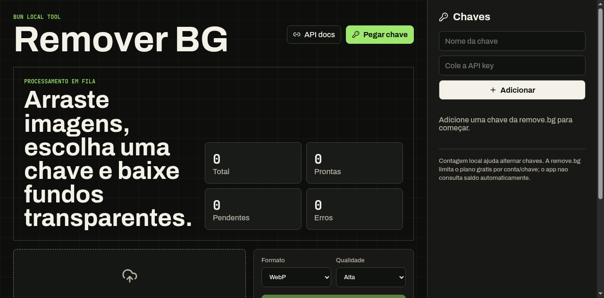

# Remover BG

Remova fundo de imagens em lote, direto da sua maquina, usando a API da [remove.bg](https://www.remove.bg/api).

O objetivo do Remover BG e ser simples: voce cola sua chave, arrasta imagens, processa a fila e baixa tudo pronto. Sem painel complicado, sem conta dentro do app, sem fluxo escondido.



## Por que usar

Se voce trabalha com produto, catalogo, ecommerce, social media ou thumbnails, remover fundo uma imagem por vez fica cansativo rapido. Este app resolve esse fluxo pequeno e repetitivo:

- guardar varias API keys localmente;
- escolher qual chave usar;
- processar uma fila de imagens;
- baixar cada resultado ou tudo em ZIP;
- manter tudo rodando local, no seu computador.

## Destaques

- **Batch real:** arraste uma ou varias imagens.
- **Fila visual:** cada imagem mostra estado, erro, preview e download.
- **Varias chaves:** adicione mais de uma API key e troque com `usar`.
- **Controle local:** contador simples mostra quantas imagens voce processou por chave neste navegador.
- **WebP ou PNG:** escolha formato antes de processar.
- **Alta ou Preview:** escolha qualidade conforme seu uso.
- **ZIP pronto:** clique em `Baixar tudo` para salvar todos os resultados processados.
- **Local-first:** servidor Bun local, interface no navegador.

## Demo

A tela principal tem tres partes:

1. **Fila de imagens:** onde voce arrasta arquivos e acompanha resultados.
2. **Controles de processamento:** formato, qualidade, processar fila e baixar tudo.
3. **Painel de chaves:** onde voce adiciona, remove e escolhe a API key ativa.

## Requisitos

- [Bun](https://bun.sh/) 1.3 ou superior
- API key da remove.bg: https://www.remove.bg/api

## Comece rapido

```bash
bun install
bun run build
bun run dev
```

Abra:

```text
http://localhost:3000
```

Porta `3000` ocupada:

```bash
PORT=3001 bun run dev
```

## Como usar

1. Abra o app no navegador.
2. Clique em `Pegar chave` para abrir https://www.remove.bg/api.
3. Copie sua API key da remove.bg.
4. Cole a chave no painel `Chaves`.
5. Arraste imagens para a area de upload.
6. Escolha `WebP` ou `PNG`.
7. Escolha `Alta` ou `Preview`.
8. Clique em `Processar fila`.
9. Baixe um resultado individual ou clique em `Baixar tudo`.

## Como funciona por baixo

O frontend React cuida da experiencia: fila, previews, chaves, contadores e downloads.

O servidor Bun local recebe cada imagem e chama a API oficial:

```text
POST https://api.remove.bg/v1.0/removebg
```

Campos enviados:

| Campo | Valor |
| --- | --- |
| `image_file` | arquivo da imagem |
| `size` | `auto` ou `preview` |
| `format` | `webp` ou `png` |

A API key e enviada no header `X-Api-Key` pelo backend local.

## Chaves e limite gratis

A remove.bg define os limites do plano gratis no proprio servico. Este app nao burla limite, nao cria chaves automaticamente e nao consulta saldo.

O contador exibido no app e local. Ele serve como controle visual para voce saber quantas imagens processou com cada chave naquele navegador.

## Qualidade e formato

| Opcao | Melhor para |
| --- | --- |
| `WebP` | Arquivos menores e imagens grandes com transparencia. |
| `PNG` | Compatibilidade com editores e ferramentas antigas. |
| `Alta` | Resultado final com `size=auto`. |
| `Preview` | Testes rapidos com `size=preview`. |

## Seguranca

Este projeto foi criado para uso local.

As chaves ficam no `localStorage` do navegador. Isso e pratico para uso pessoal, mas nao e seguro para um servico publico hospedado.

Se quiser transformar isto em SaaS ou app para outras pessoas, mude a arquitetura antes:

- autentique usuarios;
- guarde chaves no backend;
- isole segredos por usuario;
- aplique rate limit;
- registre uso real por conta;
- nunca envie API keys de outros usuarios para o navegador.

## Scripts

```bash
bun run typecheck
bun run build
bun test
```

## Estrutura

```text
src/
  client/
    main.tsx       # UI React, fila, chaves, previews e downloads
    styles.css     # visual do app
  server/
    removeBg.ts    # cliente da API remove.bg e tratamento de erros
  shared/
    types.ts       # tipos compartilhados entre frontend e backend
  server.ts        # servidor Bun local
```

## Stack

- Bun
- React
- Vite
- TypeScript
- JSZip
- lucide-react
- remove.bg API

## Roadmap possivel

- Exportar historico local.
- Limpar todas as imagens da fila com um clique.
- Auto-selecionar proxima chave depois de N usos.
- Persistir configuracoes de formato e qualidade.
- Mostrar gasto real se a API expuser saldo de forma estavel.

## Licenca

MIT
